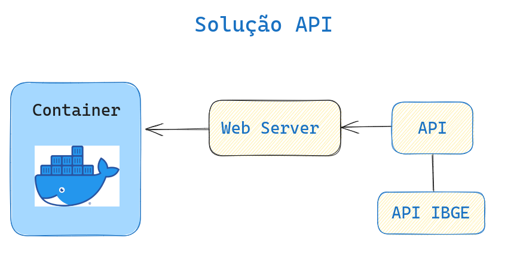

## api-a3data


Solução do desafio de cientista de dados - API  

<br>





<br>
<hr>
<br>

### Como executar a API

Siga as instruções abaixo para executar a API usando o Docker:

1. Certifique-se de ter o Docker instalado e configurado em sua máquina.
2.  Faça o clone deste repositório para o seu ambiente local.
3.Abra um terminal e navegue até o diretório raiz do projeto.
4. Execute o seguinte comando para criar a imagem Docker:

```bash
docker build -t api-a3data .
```

5. Após a conclusão do processo de build, você pode iniciar o contêiner com o seguinte comando:

```bash
docker run -p 5000:5000 api-a3data
```

6. você pode fazer uma requisição para a API utilizando o navegador, o cURL ou o Postman. Por exemplo, abra o navegador e acesse o seguinte URL:

```bash 
http://localhost:5000/api_ibge?uf=SP&info=microrregioes ```


<br>
<br>

### Detalhes da API

A API implementada neste projeto oferece um endpoint /api_ibge para obter informações sobre distritos brasileiros com base na UF (Unidade Federativa) e no tipo de informação desejada.
O endpoint aceita os seguintes parâmetros de consulta (query parameters):

uf: a UF do estado desejado (por exemplo, "SP" para São Paulo)
info: o tipo de informação desejada, que pode ser "microrregioes", "mesorregioes", "municipios" ou "distritos"

Exemplo de requisição:

```bash
GET /api_ibge?uf=SP&info=microrregioes
```

retorno: 

```
{
  "UF": "SP",
  "microrregioes": [
    "São José do Rio Preto",
    "Ribeirão Preto",
    "São Carlos",
    "Bauru",
    "Campinas",
    "Piracicaba",
    "Sorocaba",
    "Presidente Prudente",
    "Marília",
    "Assis",
    "Araçatuba",
    "Itapeva",
    "Vale do Paraíba Paulista",
    "Litoral Norte"
  ]
}
```
<br>
<br>

### Logs da API
A API registra as requisições e o tempo de execução no arquivo api_logs.log. Você pode encontrar esse arquivo no diretório raiz do projeto após executar a API.

Os logs são registrados em formato de texto simples e incluem a data, hora, UF, tipo de informação e tempo de execução de cada requisição.

Notas
* Certifique-se de ter as dependências listadas no arquivo requirements.txt instaladas antes de executar a API.
* O servidor WSGI Gunicorn é utilizado para executar a aplicação Flask dentro do contêiner Docker.
* O arquivo openssl.cnf é copiado para o diretório /etc/ssl/openssl.cnf dentro do contêiner para configurar o OpenSSL adequadamente.
* O fuso horário é definido como "America/Sao_Paulo" dentro do contêiner para garantir a exibição correta do horário nos logs.

<br>

